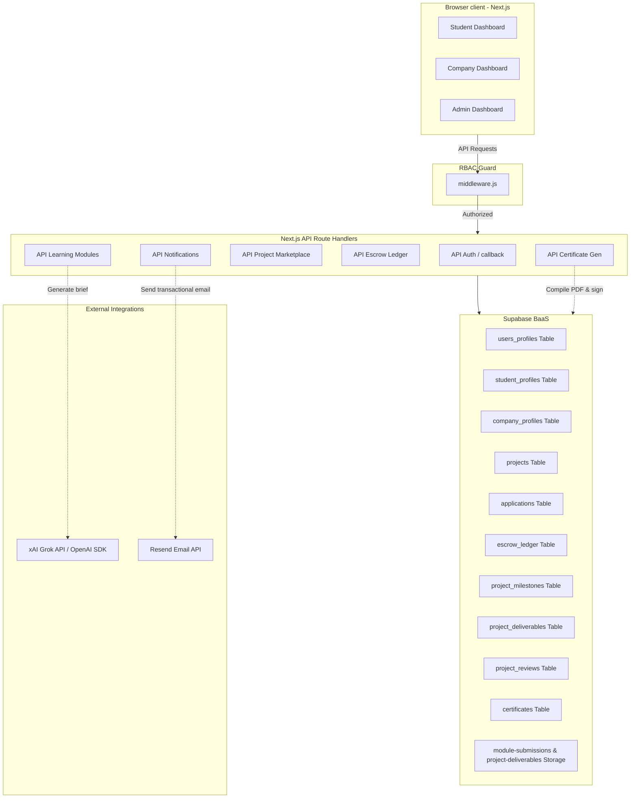

# KaajerBazar (কাজের বাজার) - Comprehensive System Documentation
**Date of Reference:** June 2026  
**Platform Version:** 1.0.0 (Release)  
**Target Audience:** Software Engineers, Project Assessors, AI Agents (Gemini/Claude) for report generation.

---

## 📖 Executive Summary & Business Case

### The Problem
Traditional freelance platforms (like Upwork or Fiverr) present high barriers to entry for students in developing nations like Bangladesh, where access to international payment methods and a mature CV history is limited. Conversely, local Small and Medium Enterprises (SMEs) face significant risks when hiring freelancers due to unverified skill claims, fluctuating quality, and a lack of secure payment/escrow mechanisms.

### The Solution
**KaajerBazar** is a serverless-first, BaaS-powered micro-freelancing marketplace designed exclusively for students and companies in Bangladesh. 
1. **No CV claims — Proof of Work:** Students prove their expertise through AI-generated, time-locked mini projects (learning modules) rather than certificates or written descriptions.
2. **Reduced SME Risk:** Only trade-license-verified companies can post projects. Applicants are sorted automatically by a reputation metric called **KaajerScore**.
3. **Financial Protection:** Funds are secured in a simulated BDT escrow system before work begins, and released instantly on approval, minus a 10% platform commission.
4. **Trust & Quality:** Anti-bias double-blind reviews, automated tier badges, and cryptographic certificate lookups verify completion.

---

## 👥 Platform Roles & Access Control (RBAC)

KaajerBazar enforces strict Role-Based Access Control (RBAC) both on the client dashboard views and at the API route handler layer using Next.js Middleware.

| Role | Onboarding Flow | Core Responsibilities & Capabilities |
| :--- | :--- | :--- |
| **Student** | Registers via email/Google OAuth. Must complete profile (university, graduation year, bio, portfolio links) to apply for jobs. | <ul><li>Attempt AI-generated skill verification tests</li><li>Submit text/ZIP file deliverables for verification</li><li>Browse/filter projects; apply with pitch note</li><li>Collaborate in Workspace (chat, milestones, deliverable uploads)</li><li>Request escrow release; receive payments to wallet</li><li>Submit blind project reviews; view completed certificates</li></ul> |
| **Company** | Registers via email. Must fill out corporate profile and **upload trade license PDF**. | <ul><li>Undergo trade license verification queue</li><li>Post micro-projects (budget, timeline, required skills)</li><li>View applicants list (sorted by KaajerScore)</li><li>Start projects by locking project budget in Escrow</li><li>Manage deliverables & approve milestones</li><li>Release payments from Escrow to Student</li><li>Submit blind project reviews</li></ul> |
| **Admin** | Manually set in database (`users_profiles.role = 'admin'`). | <ul><li>Review pending company verifications (Approve/Reject with feedback)</li><li>Grade student learning module submissions (Pass, Fail, Request Revision)</li><li>Monitor dashboard statistics, users count, and moderation logs</li><li>Create and configure learning modules/skills</li></ul> |

---

## 🧭 System Architecture & Data Flow

KaajerBazar is structured on a modern, serverless, decoupled architecture.



### Authentication & Session Management
1. **Supabase Auth Integration:** All signups register accounts in Supabase's managed `auth.users` table.
2. **Synchronization Trigger:** An internal database trigger copies new users into `users_profiles` to map roles.
3. **Session Cookies:** JSON Web Tokens (JWT) are saved in HTTP-only cookies.
4. **Middleware Validation:** On every request, `middleware.js` extracts the cookie, runs `getUser()`, refreshes the token session if expired (1-hour expiry, 7-day refresh), checks the user's role in `users_profiles`, and grants or blocks access.

---

## 🧠 Core System Engines

### 1. AI-Generated Learning & Verification Engine
Instead of standard multiple-choice exams, students prove skills by completing a practical assignment:
* **Brief Generation:** The platform sends a prompt to the Groq API (powered by `llama-3.1-8b-instant`) combining the target skill name (e.g. `Next.js`) and difficulty level (`rookie`, `skilled`, `expert`).
* **Output Structure:** The AI returns a JSON structure containing: `project_title`, `client_context`, `task_description`, `deliverables`, and `evaluation_hints`.
* **Submission Lifecycle:** The student has a deadline (24h, 48h, or 72h) to build the app and upload a ZIP file containing the code, plus a text walkthrough.
* **Cooldown & Lockout Rules:**
  * **Failed Attempt:** Carries a **24-hour cooldown** lock preventing the student from immediately retrying that skill.
  * **Repeated Failures:** If a student fails the same skill/level combo **3 times**, they are hit with a **7-day lockout** to prevent spamming the AI generation API.
* **Verified Skills:** Upon an Admin marking a submission as `pass`, the skill is permanently registered in `verified_skills`, making it visible to potential employers.

### 2. KaajerScore Reputation Engine
KaajerScore is a trust metric (clamped between `0` and `100`, rounded to `1` decimal point) reflecting a student's marketplace reliability. It is automatically recalculated upon major transactions (e.g., mutual reviews submitted or projects closed) using a **70% / 30%** weighted split:

$$\text{KaajerScore} = (0.70 \times \text{Rating Score}) + (0.30 \times \text{Project Completion Score})$$

1. **Rating Score (70%):** Scaled average stars ($1\text{ to }5$) received on completed projects, translated using:
   $$\text{Rating Score} = \frac{\text{Average Stars} - 1}{4} \times 100$$
   *Crucial Security Feature:* Only **unlocked (mutual)** reviews are factored into the average. Unilateral reviews are excluded to prevent ratings blackmail.
2. **Project Completion Score (30%):** Calculated as:
   $$\text{Completion Score} = \frac{\text{Completed Projects}}{\text{Total Assigned Projects (Closed)}} \times 100$$
   *Edge Case:* If a student has active assignments but none have closed yet, the completion score is treated as 100% so as not to penalize new starters.
   *Null State:* Brand-new accounts with no history have their KaajerScore set to `null` to indicate a blank slate.

### 3. Automated Badge System
Students are rewarded with automated profile badges to signal hierarchy and experience in search directories. Evaluation happens at the end of each project completion lifecycle:

* **🌟 Rising Star (`rising_talent`):** Lifetime wallet earnings $\ge$ BDT 20,000 AND average rating $\ge$ 4.5.
* **⭐ Top Rated (`top_rated`):** Lifetime wallet earnings $\ge$ BDT 100,000 AND average rating $\ge$ 4.8.
* **🏆 Top Rated Plus (`top_rated_plus`):** Lifetime wallet earnings $\ge$ BDT 500,000 AND average rating $\ge$ 4.9.

*Downgrade Mechanic:* If a student's average rating falls below the threshold, the badge is marked `is_active = false` and logged in `badge_criteria_log` with the revocation reason.

### 4. Double-Blind Review System
To prevent retaliatory ratings, reviews left by a company or student are locked:
* Unilateral ratings are not shown on public profiles and do not impact the KaajerScore.
* Once **both** parties submit feedback (or the review window expires), the records are unlocked and published.

### 5. Escrow Payment & Ledger Engine
Ensures that students get paid for completed work, and companies do not lose money to non-performance:
* **Escrow Deposit:** A company selects an applicant and starts the project. This changes `escrow_status` to `held`. (Simulated BDT transaction).
* **Ledger Entries:** Every flow creates balanced transaction records in `escrow_ledger`.
* **Milestones & Deliverables:** Students submit files inside the workspace. The company reviews and signs off.
* **Release & Wallet Update:** On project completion, the funds are released. **10% is deducted** as platform commission and saved to a platform vault account, while the remaining **90% is added** to the student's `wallet_balance` via a database function (`increment_wallet`).

---

## 📊 Database Schema Directory

Below are the table declarations and constraints enforced in the PostgreSQL database.

```
                  ┌─────────────────┐
                  │  auth.users     │ (Supabase Managed)
                  └────────┬────────┘
                           │ 1:1
                  ┌────────▼────────┐
                  │ users_profiles  ◄────────────────────────┐
                  └────┬──────────┬─┘                        │
                       │ 1:1      │ 1:1                      │
         ┌─────────────▼───┐   ┌──▼──────────────┐           │
         │student_profiles │   │company_profiles │           │
         └─────────────┬───┘   └──────────┬──────┘           │
                       │ 1:N              │ 1:N              │
         ┌─────────────▼───┐              │                  │
         │  applications   │              │                  │
         └─────────────▲───┘              │                  │
                       │ 1:1              │                  │
                  ┌────┴──────────────────▼┐                 │
                  │       projects         ◄────────┐        │
                  └────┬──────────┬──────┬─┘        │        │
                       │ 1:N      │ 1:N  │ 1:N      │        │
         ┌─────────────▼──┐       │      │     ┌────┴─────┐  │
         │project_milest. │       │      │     │ escrow_  │  │
         └─────────────┬──┘       │      │     │ ledger   │  │
                       │ 1:N      │      │     └──────────┘  │
         ┌─────────────▼──┐       │      │                   │
         │project_deliv.  ├───────┘      │     ┌──────────┐  │
         └────────────────┘              ├─────►project_  │  │
                                         │     │ reviews  ├──┘ (Reviewer &
                                         │     └──────────┘     Reviewee)
                                         │
                                         │     ┌──────────┐
                                         ├─────►chat_     │
                                         │     │ messages │
                                         │     └──────────┘
                                         │
                                         │     ┌──────────┐
                                         └─────►certific. │
                                               └──────────┘
```

### 1. `users_profiles`
Master account profile matching credentials in `auth.users`.
* `id` (`UUID`, PRIMARY KEY): Foreign key referencing `auth.users(id)`.
* `role` (`TEXT`): User role restriction: `CHECK (role IN ('student', 'company', 'admin'))`.
* `email` (`TEXT`): Account email address.
* `full_name` (`TEXT`): Profile name.
* `avatar_url` (`TEXT`): URL to profile image stored in bucket.
* `created_at` (`TIMESTAMPTZ`): Record creation time.

### 2. `student_profiles`
Holds student education background, wallet, and reputation statistics.
* `id` (`UUID`, PRIMARY KEY): Foreign key referencing `users_profiles(id)`.
* `username` (`TEXT`, UNIQUE): Unique handle.
* `university` (`TEXT`): University name.
* `graduation_year` (`INTEGER`): Graduation year.
* `bio` (`TEXT`): Profile bio.
* `about_text` (`TEXT`): Long-form introduction.
* `skills` (`TEXT[]`): Declared skill titles.
* `portfolio_url` (`TEXT`): Personal website link.
* `wallet_balance` (`DECIMAL`): Withdrawable balance in BDT.
* `kaajerscore` (`DECIMAL`): Calculated trust score (0 to 100).
* `completion_rate` (`DECIMAL`): Percentage of projects successfully finished.

### 3. `company_profiles`
Holds company details and licensing checks.
* `id` (`UUID`, PRIMARY KEY): Foreign key referencing `users_profiles(id)`.
* `legal_name` (`TEXT`): Corporate legal name.
* `website` (`TEXT`): Company website.
* `industry` (`TEXT`): Industry category.
* `description` (`TEXT`): Detailed profile write-up.
* `verified` (`BOOLEAN`): Global approval flag.
* `trade_license_url` (`TEXT`): Path to uploaded trade license PDF in private bucket.
* `verification_status` (`TEXT`): Verification lifecycle: `CHECK (verification_status IN ('not_submitted', 'pending', 'verified', 'rejected'))`.
* `verification_feedback` (`TEXT`): Explanation comments left by verifying Admin.
* `verified_at` (`TIMESTAMPTZ`): Verification date.
* `verified_by` (`UUID`): References `users_profiles(id)` of approving Admin.
* `license_uploaded_at` (`TIMESTAMPTZ`): Time trade license file was uploaded.

### 4. `learning_modules`
Admin-created definitions of skill paths and difficulty levels.
* `id` (`UUID`, PRIMARY KEY): Unique identifier.
* `skill_category` (`TEXT`): Category: `CHECK (skill_category IN ('tech', 'design', 'content', 'marketing', 'data'))`.
* `skill_name` (`TEXT`): Name of skill (e.g. React, Figma).
* `difficulty_level` (`TEXT`): Difficulty: `CHECK (difficulty_level IN ('rookie', 'skilled', 'expert'))`.
* `deadline_hours` (`INTEGER`): Hours allowed to finish: `CHECK (deadline_hours IN (24, 48, 72))`.
* `is_active` (`BOOLEAN`): Status flag.
* `created_at` (`TIMESTAMPTZ`): Creation timestamp.

### 5. `module_submissions`
Students' submissions for learning modules.
* `id` (`UUID`, PRIMARY KEY): Unique identifier.
* `student_id` (`UUID`): References `users_profiles(id)`.
* `module_id` (`UUID`): References `learning_modules(id)`.
* `ai_brief` (`TEXT`): Grok-generated project brief in JSON format.
* `submission_file_url` (`TEXT`): Path to ZIP code package in private bucket.
* `submission_description` (`TEXT`): Detailed text explanation by student.
* `status` (`TEXT`): Submission state: `CHECK (status IN ('pending', 'pass', 'fail', 'revision'))`.
* `attempt_number` (`INTEGER`): Tracking index (up to 3).
* `cooldown_until` (`TIMESTAMPTZ`): Lockout release timestamp.
* `deadline_at` (`TIMESTAMPTZ`): Time submission is due.
* `submitted_at` (`TIMESTAMPTZ`): Timestamp when submitted.
* `reviewed_at` (`TIMESTAMPTZ`): Timestamp of admin review.
* `reviewed_by` (`UUID`): References `users_profiles(id)` of grading Admin.
* `admin_feedback` (`TEXT`): Comments left by Admin.
* `created_at` (`TIMESTAMPTZ`): Attempt start timestamp.

### 6. `verified_skills`
Stores verified skills after passing learning modules.
* `id` (`UUID`, PRIMARY KEY): Unique identifier.
* `student_id` (`UUID`): References `users_profiles(id)`.
* `skill_name` (`TEXT`): Name of verified skill.
* `skill_category` (`TEXT`): Category of skill.
* `level` (`TEXT`): Verified level: `CHECK (level IN ('rookie', 'skilled', 'expert'))`.
* `earned_at` (`TIMESTAMPTZ`): Verification date.
* `module_submission_id` (`UUID`): References `module_submissions(id)`.
* *Constraint:* Unique constraint on `(student_id, skill_name, level)`.

### 7. `student_badges`
Badges earned by students based on marketplace transactions.
* `id` (`UUID`, PRIMARY KEY): Unique identifier.
* `student_id` (`UUID`): References `users_profiles(id)`.
* `badge_type` (`TEXT`): Badge tier: `CHECK (badge_type IN ('rising_talent', 'top_rated', 'top_rated_plus'))`.
* `is_active` (`BOOLEAN`): Active flag.
* `awarded_at` (`TIMESTAMPTZ`): Award date.
* `revoked_at` (`TIMESTAMPTZ`): Revocation timestamp.
* `revoke_reason` (`TEXT`): Reason badge was lost.

### 8. `badge_criteria_log`
Audit trails of badge updates.
* `id` (`UUID`, PRIMARY KEY): Unique identifier.
* `student_id` (`UUID`): References `users_profiles(id)`.
* `badge_type` (`TEXT`): Evaluated badge.
* `action` (`TEXT`): Evaluation action: `CHECK (action IN ('awarded', 'revoked', 'restored', 'checked'))`.
* `criteria_snapshot` (`JSONB`): State snapshot at calculation time (earnings, rating).
* `checked_at` (`TIMESTAMPTZ`): Timestamp.

### 9. `projects`
Jobs posted by verified companies.
* `id` (`UUID`, PRIMARY KEY): Unique identifier.
* `company_id` (`UUID`): References `company_profiles(id)`.
* `title` (`TEXT`): Project title.
* `description` (`TEXT`): Core descriptions.
* `required_skills` (`TEXT[]`): Skill keywords requested.
* `budget_bdt` (`DECIMAL`): Project budget in BDT.
* `duration_weeks` (`INTEGER`): Timeline duration.
* `status` (`TEXT`): Project phase: `CHECK (status IN ('open', 'in_progress', 'completed', 'cancelled'))`.
* `deadline` (`DATE`): Delivery deadline.
* `deliverable_format` (`TEXT`): Format details.
* `escrow_status` (`TEXT`): Payment state: `CHECK (escrow_status IN ('not_deposited', 'held', 'released', 'refunded'))`.
* `created_at` (`TIMESTAMPTZ`): Posting date.

### 10. `applications`
Student job applications.
* `id` (`UUID`, PRIMARY KEY): Unique identifier.
* `project_id` (`UUID`): References `projects(id)`.
* `student_id` (`UUID`): References `student_profiles(id)`.
* `cover_note` (`TEXT`): Pitch explanation.
* `portfolio_item_url` (`TEXT`): Reference link.
* `status` (`TEXT`): Application state: `CHECK (status IN ('pending', 'selected', 'rejected'))`.
* `created_at` (`TIMESTAMPTZ`): Apply timestamp.

### 11. `project_milestones`
Milestone lists inside active workspaces.
* `id` (`UUID`, PRIMARY KEY): Unique identifier.
* `project_id` (`UUID`): References `projects(id)`.
* `title` (`TEXT`): Milestone description.
* `status` (`TEXT`): Status: `CHECK (status IN ('pending', 'completed'))`.
* `created_at` (`TIMESTAMPTZ`): Creation date.
* `completed_at` (`TIMESTAMPTZ`): Milestone sign-off date.

### 12. `project_deliverables`
Student deliverables uploaded for milestoning.
* `id` (`UUID`, PRIMARY KEY): Unique identifier.
* `project_id` (`UUID`): References `projects(id)`.
* `student_id` (`UUID`): References `student_profiles(id)`.
* `submission_text` (`TEXT`): Written explanation.
* `submission_file_url` (`TEXT`): Path to file in private bucket.
* `file_name` (`TEXT`): Basename of uploaded file.
* `file_size_bytes` (`BIGINT`): Size metadata.
* `file_mime_type` (`TEXT`): MIME category.
* `status` (`TEXT`): Review state: `CHECK (status IN ('pending', 'approved', 'rejected'))`.
* `company_feedback` (`TEXT`): Review notes left by Company.
* `created_at` (`TIMESTAMPTZ`): Upload timestamp.
* `reviewed_at` (`TIMESTAMPTZ`): Review date.

### 13. `escrow_ledger`
Platform financial audit trail.
* `id` (`UUID`, PRIMARY KEY): Unique identifier.
* `project_id` (`UUID`): References `projects(id)`.
* `event_type` (`TEXT`): Operation type: `CHECK (event_type IN ('deposit', 'hold', 'release', 'refund', 'commission'))`.
* `amount_bdt` (`DECIMAL`): Transaction amount.
* `from_party` (`TEXT`): Sender: `CHECK (from_party IN ('company', 'escrow', 'platform'))`.
* `to_party` (`TEXT`): Recipient: `CHECK (to_party IN ('escrow', 'student', 'platform'))`.
* `created_at` (`TIMESTAMPTZ`): Date log.

### 14. `project_reviews`
Feedbacks exchanged between parties.
* `id` (`UUID`, PRIMARY KEY): Unique identifier.
* `project_id` (`UUID`): References `projects(id)`.
* `reviewer_id` (`UUID`): References `users_profiles(id)`.
* `reviewee_id` (`UUID`): References `users_profiles(id)`.
* `rating` (`INTEGER`): Rating scale: `CHECK (rating >= 1 AND rating <= 5)`.
* `comment` (`TEXT`): Core review body.
* `created_at` (`TIMESTAMPTZ`): Feedback date.
* *Constraint:* Unique constraint on `(project_id, reviewer_id)`.

### 15. `chat_messages`
Real-time workspace conversations.
* `id` (`UUID`, PRIMARY KEY): Unique identifier.
* `project_id` (`UUID`): References `projects(id)`.
* `sender_id` (`UUID`): References `users_profiles(id)`.
* `content` (`TEXT`): Messages.
* `created_at` (`TIMESTAMPTZ`): Timestamp.

### 16. `notifications`
In-app alerts system.
* `id` (`UUID`, PRIMARY KEY): Unique identifier.
* `user_id` (`UUID`): References `users_profiles(id)`.
* `type` (`TEXT`): Category (e.g. system, application, chat).
* `title` (`TEXT`): Alert header.
* `body` (`TEXT`): Detail copy.
* `data` (`JSONB`): Meta redirect links.
* `is_read` (`BOOLEAN`): Read indicator flag.
* `created_at` (`TIMESTAMPTZ`): Trigger timestamp.

### 17. `notification_preferences`
Per-user email preferences.
* `user_id` (`UUID`, PRIMARY KEY): References `users_profiles(id)`.
* `email_enabled` (`BOOLEAN`): Opt-in status.
* `email_important_only` (`BOOLEAN`): Volume constraint.
* `muted_types` (`TEXT[]`): Muted notification types.
* `updated_at` (`TIMESTAMPTZ`): Date changed.

### 18. `certificates`
System certificates.
* `id` (`UUID`, PRIMARY KEY): Unique identifier.
* `project_id` (`UUID`): References `projects(id)`.
* `student_id` (`UUID`): References `student_profiles(id)`.
* `pdf_url` (`TEXT`): Location on bucket.
* `issued_at` (`TIMESTAMPTZ`): Issuance date.

---

## 🔗 Selected API Reference

All custom routes reside in `/src/app/api/` and enforce JWT checking and RBAC logic.

| Category | Endpoint Route | Method | Allowed Roles | Description |
| :--- | :--- | :--- | :--- | :--- |
| **Auth** | `/api/auth/register` | `POST` | Public | Registers user profile in database. |
| **Auth** | `/api/auth/callback` | `GET` | Public | Auth callback handler. |
| **Admin** | `/api/admin/pending-companies` | `GET` | `admin` | Fetches companies awaiting trade license approval. |
| **Admin** | `/api/admin/verify-company` | `POST` | `admin` | Approves/rejects trade licenses with comments. |
| **Admin** | `/api/admin/learning/queue` | `GET` | `admin` | Fetches ungraded skill tests. |
| **Admin** | `/api/admin/learning/submissions/[id]/review` | `POST` | `admin` | Grades submissions (`pass`, `fail`, `revision`). |
| **Learning** | `/api/learning/categories` | `GET` | `student` | Lists active skill test categories. |
| **Learning** | `/api/learning/modules/[id]/start` | `POST` | `student` | Triggers Groq API to create brief & begins timer. |
| **Learning** | `/api/learning/modules/[id]/submit` | `POST` | `student` | Uploads zip file deliverable to S3 & details. |
| **Marketplace**| `/api/projects` | `GET` | `student` | Browse open, pending, and filterable jobs. |
| **Marketplace**| `/api/projects` | `POST` | `company` | Creates and publishes new job requirements. |
| **Marketplace**| `/api/applications` | `POST` | `student` | Apply to project with cover letter. |
| **Marketplace**| `/api/company/applications` | `GET` | `company` | View list of applicants, sorted by KaajerScore. |
| **Workspace** | `/api/projects/[id]/start` | `POST` | `company` | Deposits funds into Escrow; transitions project. |
| **Workspace** | `/api/projects/[id]/milestones` | `POST` | `company` | Appends tasks or requirements to workspace tracker. |
| **Workspace** | `/api/projects/[id]/deliverables`| `POST` | `student` | Submit project files for review. |
| **Workspace** | `/api/projects/[id]/chat` | `POST` | Participant | Sends chat message to realtime websocket publication. |
| **Workspace** | `/api/projects/[id]/release` | `POST` | `company` | Approves work, releases BDT, triggers KaajerScore. |
| **Workspace** | `/api/projects/[id]/certificate` | `GET` | Participant | Generates and signs PDF certificate. |
| **Public** | `/api/verify-certificate?id=...`| `GET` | Public | Cryptographic lookup and verification. |

---

## 🛠️ Key File Catalog

Below is the directory mapping of the core logical modules.

* **Routing Guard:** `src/middleware.js` — Checks cookies and routes users based on dashboard roles (`/student`, `/company`, `/admin`).
* **Reputation Engine:** [src/lib/kaajerscore.js](file:///c:/Users/omorf/Desktop/kajerbajar/src/lib/kaajerscore.js) — Computes student scores dynamically and triggers on project payouts.
* **Badge Automation:** [src/lib/badges.js](file:///c:/Users/omorf/Desktop/kajerbajar/src/lib/badges.js) — Allocates Rising Star, Top Rated, and Top Rated Plus tiers.
* **AI Engine Wrapper:** `src/lib/ai.js` — Connects to OpenAI SDK and Groq API; templates prompt configurations.
* **Websocket Notifications:** `src/lib/server-notifications.js` — Dispatches alerts to in-app layouts and triggers Resend notifications.
* **PDF Certificate Generator:** `src/app/api/projects/[id]/certificate/route.js` — Compiles vectors, text overlay, and layout templates using `pdf-lib`.
* **Milestone UI React Engine:** `src/components/workspace/MilestoneTracker.jsx` — Visual drag-and-drop / checkbox workflow manager.

---

## ⚙️ Tech Stack & Dependencies

The platform is built on Next.js 14 and Supabase.

### Core Stack
* **Framework:** Next.js `14.2.35` (App Router configuration).
* **Runtime library:** React `18.3.x` (Server and Client components).
* **Database & Auth:** Supabase PostgreSQL with Row Level Security (RLS) policies.
* **Simulated Ledger:** Local client-server queries bypass gateway to prevent race-conditions.

### Installed Packages (`package.json`)
* **openai (`^6.35.0`):** Communicates with OpenAI-compatible Groq endpoints.
* **pdf-lib (`^1.17.1`):** Programmatic PDF construction.
* **resend (`^6.12.3`):** Mail integration API.
* **framer-motion (`^12.38.0`):** Page transitions and slider animations.
* **lucide-react (`^1.7.0`):** Component vector icons.
* **tailwindcss (`^3.4.1`):** UI styling.

---

## 🏗️ Detailed Feature Workflows

### 🛠️ Onboarding & Profile Customization
1. **Google OAuth & Password Auth:** Managed entirely via Supabase Auth.
2. **Profile Completion:** Users complete legal names, avatars, university info, portfolios, and details.
3. **Editable Fields:** `/student/profile/edit` and `/company/profile/edit` update both `users_profiles` and their respective role profiles.

### 🛡️ Trade License Verification Queue
1. **Company Uploads License:** PDF/Image uploaded directly to private storage.
2. **Status Changes:** Transition from `not_submitted` $\rightarrow$ `pending`.
3. **Admin Actions:** Admin reviews the document via dashboard queue `/admin/company-queue` and decides to:
   * **Approve:** `verified` set to `TRUE`, `verification_status` to `verified`.
   * **Reject:** `verification_status` to `rejected` with custom review logs.

```
       ┌────────────────────────┐
       │     not_submitted      │
       └───────────┬────────────┘
                   │ Company uploads PDF
                   ▼
       ┌────────────────────────┐
       │        pending         │
       └─────┬────────────┬─────┘
             │            │
   Admin     │            │ Admin
   Approves  │            │ Rejects
             ▼            ▼
 ┌───────────────┐    ┌───────────────┐
 │   verified    │    │   rejected    │
 └───────────────┘    └───────┬───────┘
                              │ Company re-uploads
                              ▼
                      [ Back to pending ]
```

### 🧠 Groq-Powered Skill Verification
1. **Student requests skill module:** A prompt triggers a Groq completion to outline project instructions.
2. **Timer Starts:** Student gets 24h/48h/72h to complete the challenge.
3. **Admin Grades Work:** Admin verifies via `/admin/skill-test-queue`.
   * **Pass:** Permanently adds row to `verified_skills`.
   * **Fail/Revision:** Student is notified and locked out under cool-down limits.

### 💳 Escrow, Workspace, & Payments
1. **Escrow Hold:** Company starts project, shifting `escrow_status` to `held`.
2. **Milestone Tracking:** Real-time milestone changes inside workspace.
3. **Payment Release:** Payment releases to student wallet, applying 10% platform fee.
4. **Certificate Issuance:** A completion PDF is created and logged in `certificates` table.

```
 [ company: budget deposit ] ──► ( held ) ──► [ student: deliverables upload ]
                                                   │
                                                   ▼
 [ student: wallet increment ] ◄── ( released ) ◄── [ company: releases funds ]
```

---

## 🔒 Security & Trust Model

### Row Level Security (RLS)
Every database table has RLS enabled by default:
* **`users_profiles`:** Read-only for authenticated users; update allowed only for owner profiles.
* **`company_profiles`:** Publicly readable; updates restricted to owners and admins.
* **`module_submissions`:** Students can only read/insert their own records. Admins can view/update all.
* **`student_badges`:** Read-only for public; updates restricted to Admins.

### Storage Bucket Protections
* **`trade-licenses` / `module-submissions` / `project-deliverables`:** Buckets set to **private**. Read access is protected via signed URL queries (e.g. `storage.from().createSignedUrl()`) with temporary token bounds.

---

## ⚙️ Project Launch & Environment Setup

### Prerequisites
* **Node.js:** v18.0.0 or higher.
* **Supabase account:** DB + Auth + Storage configuration.

### Environment Setup (`.env.local`)
Create a file named `.env.local` in your root folder and configure:

```bash
NEXT_PUBLIC_SUPABASE_URL=your-supabase-url
NEXT_PUBLIC_SUPABASE_ANON_KEY=your-supabase-anon-key
SUPABASE_SERVICE_ROLE_KEY=your-service-role-key # Keep server-side only

# Groq AI brief configuration
GROQ_API_KEY=your-groq-key
AI_BRIEF_MODEL=llama-3.1-8b-instant
AI_BRIEF_BASE_URL=https://api.groq.com/openai/v1

# Notifications (Optional)
RESEND_API_KEY=your-resend-key
NEXT_PUBLIC_APP_URL=http://localhost:3000
```

### Database Deployment Execution
1. Run `supabase/schema.sql` inside the Supabase SQL editor.
2. Run migrations 002 through 013 in alphabetical/chronological order.
3. Create buckets `trade-licenses`, `module-submissions`, and `project-deliverables` via Supabase dashboard storage panel and mark them private.

---

## 🧪 Testing Infrastructure & Executing Test Suites

The project uses Node's native HTTP execution loops. All tests are located in `/tests/`.

### Run Test Suites
Verify routing configurations and permissions:
```bash
npm run test:auth          # Verifies signup workflows and RBAC permissions
npm run test:middleware    # Verifies route security and token decoders
npm run test:verification  # Verifies trade license status updates
npm run test:phase1        # Runs all core authentication and RBAC checks
npm run test:phase2        # Verifies skill verification submissions
```

---

## 📅 Roadmap & Complete Phase Status

* **Phase 1: Foundation (Weeks 1-2) - COMPLETE ✅**  
  * RBAC Authentication, User Dashboards, and Trade License verifications.
* **Phase 2: Skill Verification (Weeks 3-4) - COMPLETE ✅**  
  * Groq AI project briefs, submissions queues, cooldown locks, and admin grading.
* **Phase 3: Marketplace (Weeks 5-6) - COMPLETE ✅**  
  * Project listings, skills requirements, student covers, and employer applicants dashboard.
* **Phase 4: Workspace (Weeks 7-8) - COMPLETE ✅**  
  * Real-time workspace chat, milestones checklists, and deliverable uploads.
* **Phase 5: Escrow Ledger & Reputation (Weeks 9-10) - COMPLETE ✅**  
  * simulated BDT ledger, commission payouts, KaajerScore engines, and student badges.
* **Phase 6: Verification Certificates & Polish (Weeks 11-12) - COMPLETE ✅**  
  * Dynamic PDF certificate generator, `/verify-certificate` route lookups, UI polish, and bug fixes.
