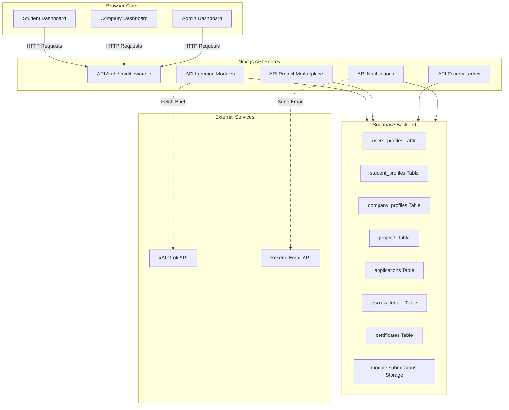

# KaajerBazar (কাজের বাজার) - Core System Documentation

Welcome to the official developer and system documentation for **KaajerBazar**, the premier student freelance and micro-project marketplace in Bangladesh. This document provides a deep-dive analysis of the system architecture, database schema, core engines, and workflows.

---

## 🧭 System Architecture & Data Flow

KaajerBazar is a serverless-first, BaaS-powered web application built using **Next.js (App Router)** and **Supabase (PostgreSQL, Auth, Storage, Realtime)**.

---

## 📊 Database Schema Directory

Below is the directory of PostgreSQL tables defined in the database:

### 1. `users_profiles`
Master account profile record for all users (synchronised with `auth.users`).
*   `id` (`UUID`, PRIMARY KEY): References `auth.users(id)`
*   `role` (`TEXT`): User type restriction `CHECK (role IN ('student', 'company', 'admin'))`
*   `email` (`TEXT`): Account email address
*   `full_name` (`TEXT`): Legal/profile full name
*   `avatar_url` (`TEXT`): Profile image storage path/link
*   `created_at` (`TIMESTAMPTZ`): Record creation time

### 2. `student_profiles`
Profiles containing student-specific education, resume, and reputation details.
*   `id` (`UUID`, PRIMARY KEY): References `users_profiles(id)`
*   `username` (`TEXT`, UNIQUE): Custom handle
*   `university` (`TEXT`): Current university name
*   `graduation_year` (`INTEGER`): Expected graduation year
*   `bio` (`TEXT`): Student self-introduction
*   `skills` (`TEXT[]`): Claimed self-selected skills
*   `portfolio_url` (`TEXT`): Link to personal portfolio website
*   `wallet_balance` (`DECIMAL`): Earned and withdrawable balance in BDT
*   `kaajerscore` (`DECIMAL`): Calculated trust score (0 to 100)
*   `completion_rate` (`DECIMAL`): Project completion percentage

### 3. `company_profiles`
Profiles containing verification details and industry classifications for registered companies/startups.
*   `id` (`UUID`, PRIMARY KEY): References `users_profiles(id)`
*   `legal_name` (`TEXT`): Registered legal name of the organization
*   `website` (`TEXT`): Company website
*   `industry` (`TEXT`): Industry category (e.g., Tech, Marketing)
*   `description` (`TEXT`): Overview of the organization
*   `verified` (`BOOLEAN`): Overall verified status flag
*   `trade_license_url` (`TEXT`): Link to uploaded trade license PDF
*   `verification_status` (`TEXT`): `CHECK (verification_status IN ('not_submitted', 'pending', 'verified', 'rejected'))`
*   `verification_feedback` (`TEXT`): Feedback comments left by verifying Admin
*   `verified_at` (`TIMESTAMPTZ`): Time of verification approval
*   `verified_by` (`UUID`): References `users_profiles(id)` of verifying Admin
*   `license_uploaded_at` (`TIMESTAMPTZ`): Time trade license was uploaded

### 4. `learning_modules`
Admin-created definitions of skill modules with their respective difficulty tiers.
*   `id` (`UUID`, PRIMARY KEY): Unique identifier
*   `skill_category` (`TEXT`): Category `CHECK (skill_category IN ('tech', 'design', 'content', 'marketing', 'data'))`
*   `skill_name` (`TEXT`): Skill name (e.g. `React`, `Figma`)
*   `difficulty_level` (`TEXT`): Difficulty tier `CHECK (difficulty_level IN ('rookie', 'skilled', 'expert'))`
*   `deadline_hours` (`INTEGER`): Time limit to complete the brief `CHECK (deadline_hours IN (24, 48, 72))`
*   `is_active` (`BOOLEAN`): Active status flag

### 5. `module_submissions`
Submissions made by students when attempting a skill verification module.
*   `id` (`UUID`, PRIMARY KEY): Unique identifier
*   `student_id` (`UUID`): References `student_profiles(id)`
*   `module_id` (`UUID`): References `learning_modules(id)`
*   `ai_brief` (`JSONB`): The Grok-generated unique project brief JSON structure
*   `submission_text` (`TEXT`): Text description of work completed
*   `submission_file_url` (`TEXT`): Link to uploaded zip/file in `module-submissions` storage bucket
*   `status` (`TEXT`): `CHECK (status IN ('pending', 'passed', 'failed', 'revision_requested'))`
*   `attempt_number` (`INTEGER`): Number of attempts made on this specific skill/level (maximum 3 before lockout)
*   `cooldown_until` (`TIMESTAMPTZ`): Cooldown lock timestamp preventing re-attempts
*   `admin_feedback` (`TEXT`): Feedback comments left by reviewing Admin
*   `submitted_at` (`TIMESTAMPTZ`): Submission timestamp
*   `deadline_at` (`TIMESTAMPTZ`): Absolute timestamp when the submission is due

### 6. `verified_skills`
Skills successfully verified by passing a learning module.
*   `id` (`UUID`, PRIMARY KEY): Unique identifier
*   `student_id` (`UUID`): References `student_profiles(id)`
*   `skill_name` (`TEXT`): Name of the verified skill
*   `skill_category` (`TEXT`): Category of the verified skill
*   `level` (`TEXT`): Passed level (`rookie`, `skilled`, `expert`)
*   `earned_at` (`TIMESTAMPTZ`): Verification date

### 7. `student_badges`
Marketplace trust tier badges assigned to students.
*   `id` (`UUID`, PRIMARY KEY): Unique identifier
*   `student_id` (`UUID`): References `student_profiles(id)`
*   `badge_type` (`TEXT`): Tier level `CHECK (badge_type IN ('rising_talent', 'top_rated', 'top_rated_plus'))`
*   `is_active` (`BOOLEAN`): Active status flag
*   `granted_at` (`TIMESTAMPTZ`): Grant date
*   `revoked_at` (`TIMESTAMPTZ`): Revoked date (if upgraded/demoted)
*   `revoke_reason` (`TEXT`): Explanation for revocation (e.g., 'Upgraded to higher tier')

### 8. `projects`
Micro-projects posted by verified companies.
*   `id` (`UUID`, PRIMARY KEY): Unique identifier
*   `company_id` (`UUID`): References `company_profiles(id)`
*   `title` (`TEXT`): Project title
*   `description` (`TEXT`): Project details
*   `required_skills` (`TEXT[]`): Array of required skills
*   `budget_bdt` (`DECIMAL`): Project budget in BDT
*   `duration_weeks` (`INTEGER`): Timeline in weeks
*   `status` (`TEXT`): `CHECK (status IN ('open', 'in_progress', 'completed', 'cancelled'))`
*   `deadline` (`DATE`): Date by which project must be completed
*   `escrow_status` (`TEXT`): `CHECK (escrow_status IN ('not_deposited', 'held', 'released', 'refunded'))`
*   `created_at` (`TIMESTAMPTZ`): Posting date

### 9. `applications`
Student applications to projects.
*   `id` (`UUID`, PRIMARY KEY): Unique identifier
*   `project_id` (`UUID`): References `projects(id)`
*   `student_id` (`UUID`): References `student_profiles(id)`
*   `cover_note` (`TEXT`): Pitch note to the company
*   `status` (`TEXT`): `CHECK (status IN ('pending', 'selected', 'rejected'))`
*   `created_at` (`TIMESTAMPTZ`): Application timestamp

### 10. `project_milestones`
Project milestones created by the company to track progress in the workspace.
*   `id` (`UUID`, PRIMARY KEY): Unique identifier
*   `project_id` (`UUID`): References `projects(id)`
*   `title` (`TEXT`): Milestone title
*   `status` (`TEXT`): `CHECK (status IN ('pending', 'completed'))`
*   `created_at` (`TIMESTAMPTZ`): Creation date

### 11. `project_deliverables`
Work submissions uploaded by students for active project milestones.
*   `id` (`UUID`, PRIMARY KEY): Unique identifier
*   `project_id` (`UUID`): References `projects(id)`
*   `student_id` (`UUID`): References `student_profiles(id)`
*   `file_url` (`TEXT`): Link to uploaded deliverables in `project-deliverables` storage bucket
*   `description` (`TEXT`): Submission message
*   `status` (`TEXT`): `CHECK (status IN ('pending', 'approved', 'rejected'))`
*   `feedback` (`TEXT`): Feedback comments left by the company
*   `created_at` (`TIMESTAMPTZ`): Upload timestamp

### 12. `project_reviews`
Double-blind mutual feedback reviews between student and company.
*   `id` (`UUID`, PRIMARY KEY): Unique identifier
*   `project_id` (`UUID`): References `projects(id)`
*   `reviewer_id` (`UUID`): References `users_profiles(id)`
*   `reviewee_id` (`UUID`): References `users_profiles(id)`
*   `rating` (`INTEGER`): 1-5 rating scale `CHECK (rating >= 1 AND rating <= 5)`
*   `feedback` (`TEXT`): Written review comment
*   `created_at` (`TIMESTAMPTZ`): Review submit timestamp

### 13. `chat_messages`
Real-time messaging inside active workspaces.
*   `id` (`UUID`, PRIMARY KEY): Unique identifier
*   `project_id` (`UUID`): References `projects(id)`
*   `sender_id` (`UUID`): References `users_profiles(id)`
*   `message` (`TEXT`): Chat text
*   `created_at` (`TIMESTAMPTZ`): Message timestamp

### 14. `notifications`
In-app real-time notification records.
*   `id` (`UUID`, PRIMARY KEY): Unique identifier
*   `user_id` (`UUID`): References `users_profiles(id)`
*   `type` (`TEXT`): System notification category (e.g. `system`, `application`, `message`)
*   `title` (`TEXT`): Summary title
*   `body` (`TEXT`): Detailed notification content
*   `data` (`JSONB`): Optional metadata (e.g., `{ "link": "/student/workspace/..." }`)
*   `is_read` (`BOOLEAN`): Read status flag
*   `created_at` (`TIMESTAMPTZ`): Creation timestamp

### 15. `certificates`
Dynamic project completion certificates issued to students.
*   `id` (`UUID`, PRIMARY KEY): Unique identifier
*   `project_id` (`UUID`): References `projects(id)`
*   `student_id` (`UUID`): References `student_profiles(id)`
*   `pdf_url` (`TEXT`): Link to certificate document (generated on-the-fly)
*   `issued_at` (`TIMESTAMPTZ`): Generation timestamp

---

## 🧠 Core System Engines

### 1. KaajerScore Engine
The trust reputation metric of a student is computed dynamically based on a **30% / 50% / 20%** split:
*   **30% - Verified Skills Score:** Calculated as `(verified_skill_count / VERIFIED_SKILL_TARGET) * 100`, capped at 100. The default target is 10 unique verified skills.
*   **50% - Average Project Rating:** scaled from a 1-5 rating to 0-100, i.e., `((avgStars - 1) / 4) * 100`. Crucially, only **unlocked reviews** (where a double-blind review process has completed) are included.
*   **20% - Project Completion Rate:** Calculated as `(completed_projects / total_closed_projects) * 100`. If a student has active projects but none are closed yet, the completion score is treated as 100%.

The recalculation code is housed in [src/lib/kaajerscore.js](file:///c:/Users/omorf/Desktop/kajerbajar/src/lib/kaajerscore.js) and is triggered automatically when escrows are released or mutual reviews are submitted.

### 2. Badge Automation Engine
Automated marketplace badges are assigned to student profiles dynamically to reflect transaction history and performance metrics:
*   **Rising Talent (🌟):** Lifetime wallet earnings $\ge$ BDT 20,000 and average rating $\ge$ 4.5.
*   **Top Rated (⭐):** Lifetime wallet earnings $\ge$ BDT 100,000 and average rating $\ge$ 4.8.
*   **Top Rated Plus (🏆):** Lifetime wallet earnings $\ge$ BDT 500,000 and average rating $\ge$ 4.9.

The badge evaluation is handled in [src/lib/badges.js](file:///c:/Users/omorf/Desktop/kajerbajar/src/lib/badges.js) and runs at the end of every project lifecycle.

### 3. AI Learning & Brief Generator
Replaces traditional exams with dynamic 2-hour mini projects generated on the fly.
*   Uses Grok API (`llama-3.1-8b-instant` or similar) via an OpenAI-compatible SDK.
*   Provides structured instructions (`project_title`, `client_context`, `task_description`, `deliverables`, `evaluation_hints`).
*   Includes attempt-tracking: max 3 failed submissions will trigger a **7-day lockout** on that skill, while single failures carry a **24-hour cooldown** lock.

The generation helper is located in [src/lib/ai.js](file:///c:/Users/omorf/Desktop/kajerbajar/src/lib/ai.js).

### 4. Double-Blind Review System
Prevents rating manipulation and bias:
*   Feedback and ratings remain locked until **both parties** (student and company) have submitted reviews.
*   Once both reviews are present, the reviews become public, the ratings are unlocked, and the student's `kaajerscore` is recalculated.

### 5. Escrow & Project Tracking
Enforces safe financial custody:
*   **Escrow Deposit:** Work cannot begin until the company deposits BDT funds into the platform ledger (`escrow_status` moves to `held`).
*   **Milestone Tracker:** Companies create milestones; students complete them. Managed dynamically via [src/components/workspace/MilestoneTracker.jsx](file:///c:/Users/omorf/Desktop/kajerbajar/src/components/workspace/MilestoneTracker.jsx).
*   **Payout Release:** On review approval, the ledger is updated, a 10% commission is deducted, and the remaining 90% is instantly added to the student's wallet balance.

### 6. Notifications & Communications
*   **Real-time Chat:** Built with Supabase Realtime WebSockets for zero latency inside the workspace.
*   **In-App Alerts:** Custom dropdown inside the main header layout, updating in real-time.
*   **Email Engine:** Transactions trigger transactional emails via the **Resend API** if configured in the environment.

---

## 🛠️ Key Files Reference

*   **RBAC & Access Control:** [src/middleware.js](file:///c:/Users/omorf/Desktop/kajerbajar/src/middleware.js)
*   **AI Engine:** [src/lib/ai.js](file:///c:/Users/omorf/Desktop/kajerbajar/src/lib/ai.js)
*   **KaajerScore Formula:** [src/lib/kaajerscore.js](file:///c:/Users/omorf/Desktop/kajerbajar/src/lib/kaajerscore.js)
*   **Badges Automation:** [src/lib/badges.js](file:///c:/Users/omorf/Desktop/kajerbajar/src/lib/badges.js)
*   **Notifications Wrapper:** [src/lib/server-notifications.js](file:///c:/Users/omorf/Desktop/kajerbajar/src/lib/server-notifications.js)
*   **Workspace Milestone Tracker:** [src/components/workspace/MilestoneTracker.jsx](file:///c:/Users/omorf/Desktop/kajerbajar/src/components/workspace/MilestoneTracker.jsx)
*   **In-App Alerts UI:** [src/components/NotificationsDropdown.jsx](file:///c:/Users/omorf/Desktop/kajerbajar/src/components/NotificationsDropdown.jsx)
*   **Certificate PDF Renderer:** [src/app/api/projects/[id]/certificate/route.js](file:///c:/Users/omorf/Desktop/kajerbajar/src/app/api/projects/%5Bid%5D/certificate/route.js)

---

## 🚀 Deployment Checklist

When deploying KaajerBazar to Vercel, ensure the following steps are followed:

1.  **Configure environment variables (`.env.local` mappings):**
    *   `NEXT_PUBLIC_SUPABASE_URL`: Supabase Project URL.
    *   `NEXT_PUBLIC_SUPABASE_ANON_KEY`: Supabase Client Anonymous API key.
    *   `SUPABASE_SERVICE_ROLE_KEY`: Service role secret (strictly server-side).
    *   `GROQ_API_KEY`: API key for Grok/Groq AI brief generation.
    *   `RESEND_API_KEY`: Transactional email delivery key (optional).
    *   `NEXT_PUBLIC_APP_URL`: Vercel domain URL (e.g. `https://kaajerbazar.vercel.app`).
2.  **Verify Supabase migrations:** Run all migration files in sequence from `supabase/` folder inside the SQL Editor.
3.  **Storage Buckets:**
    *   Ensure buckets `trade-licenses`, `module-submissions`, and `project-deliverables` are created and set to **private**.
    *   Apply storage RLS policies as described in the respective migrations files.
